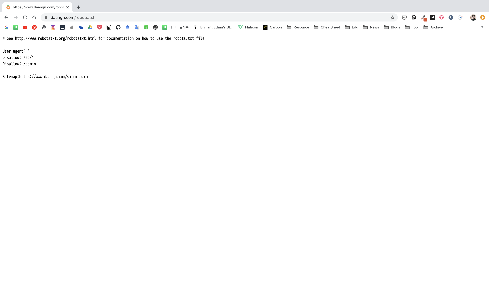

# (Unofficial) Daangn Price API [](https://travis-ci.org/hihiboss/daangn-price-api)

This project is my toy project for the [Daangn Market](https://www.daangn.com/). In the Daangn Market service, we can search flea market articles using just keyword.

Daangn Price API provides some features about articles of the Daangn Market using price.


## System

- Spring
- Maria DB
- Docker
- Travis CI
- AWS CodeDeploy
- AWS EC2


## Usage

This API supports REST.


### Search Article

Method is here:

`GET`

URI is here:

```
http://{server-url}/api/v1/articles?keyword={keyword}&startPrice={startPrice}&endPrice={endPrice}
```

Variables are here:

|Variable|Type|Description|
|---|---|---|
|server-url|URL|Server URL of the endpoint|
|keyword|String|Keyword to search|
|startPrice|Integer|Minimum price to search|
|endPrice|Integer|Maximum price to search|

Response example is here:

```json
[
  {
    "id": 12345678,
    "title": "This is title.",
    "content": "This is content.",
    "region": "This is region",
    "price": "1,000원",
    "priceValue": 1000
  },
  ...
]
```

Response type is here:

|Key|Type|Description|
|---|---|---|
|id|Long|Article ID of the Danngn Market|
|title|String|Title of article|
|content|String|Content of article|
|region|String|Region of article|
|price|String|Price of article|
|priceValue|Integer|Price value of article|

### All Search History

Method is here:

`GET`

URI is here:

```
http://{server-url}/api/v1/histories
```

Variables are here:

|Variable|Type|Description|
|---|---|---|
|server-url|URL|Server URL of the endpoint|

Response example is here:

```json
[
  {
    "id": 1,
    "keyword": "this is keyword",
    "minPrice": 1,
    "maxPrice": 50000,
    "articleIdList": [
      12345678,
      ...
    ]
  },
  ...
]
```

Response type is here:

|Key|Type|Description|
|---|---|---|
|id|Long|History ID of this API|
|keyword|String|Keyword searched|
|minPrice|Integer|Minimum price searched|
|maxPrice|Integer|Maximum price searched|
|articleIdList|Array of Long|Article ID group of searching result|

### Search History for Specific Keyword

Method is here:

`GET`

URI is here:

```
http://{server-url}/api/v1/histories/{keyword}
```

Variables are here:

|Variable|Type|Description|
|---|---|---|
|server-url|URL|Server URL of the endpoint|
|keyword|String|Keyword to query history|

Response example is here:

```json
[
  {
    "id": 1,
    "keyword": "this is keyword",
    "minPrice": 1,
    "maxPrice": 50000,
    "articleIdList": [
      12345678,
      ...
    ]
  },
  ...
]
```

Response type is here:

|Key|Type|Description|
|---|---|---|
|id|Long|History ID of this API|
|keyword|String|Keyword searched|
|minPrice|Integer|Minimum price searched|
|maxPrice|Integer|Maximum price searched|
|articleIdList|Array of Long|Article ID group of searching result|


## Robots



Check robots.txt of the Daangn Market in [Here](https://daangn.com/robots.txt).